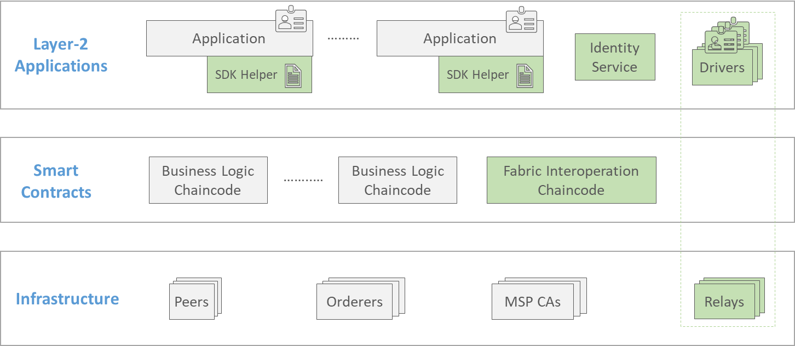

<!--
 Copyright IBM Corp. All Rights Reserved.

 SPDX-License-Identifier: CC-BY-4.0
 -->

After testing the Weaver interoperation mechanisms on [toy networks](../test-network/overview.md), you may be interested in finding out how you can equip an existing real network, whether in development or in production, to exercise these mechanisms. In this document, we will demonstrate how to equip a Fabric network and application with Weaver components and capabilities.

## Model

The figure below illustrates a typical Fabric network. The infrastructure consists of a set of peers, ordering service nodes, and CAs that perform the roles of MSPs; each serves a given _organization_ which is one of the constituent units of the network. On the peers are installed one or more smart contracts (_chaincode_), representing shared business logic across the different organizations. Further up lie the so-called Layer-2 applications that consist of organization-specific business logic and invoke the smart contracts using APIs exposed by the Fabric SDK and with wallet credentials issued by their respective organizations' CAs.

Such a network equipped with Weaver components and capabilities will look like the figure below. Legacy components are marked in grey and Weaver and bridging components in green.

The relay and driver are the only additional infrastructure that need to be installed. One or more relays can be installed, as can one or more drivers. The drivers are illustrated in Layer-2 rather than in the bottom layer because, though they are coupled with relays, they exercise contracts using the Fabric SDK and organization-issued credentials just like any Layer-2 application does.

Existing chaincode deployed on the network's channels remain undisturbed. All that is required in the smart contracts layer is the deployment of the Fabric Interoperation Chaincode on every channel that needs to offer or consume state from foreign networks.

Layer-2 applications will need some additional code and configuration because the decisions to exercise interoperation mechanisms (relay queries for data sharing or atomic asset exchanges) are strictly part of business logic. But Weaver's Fabric Interoperation Node SDK offers various helper functions to ease this process and keep the adaptation to a minimum, as we wil see later in this document. Finally, an _identity service_ must be offered by the network to expose its CAs' certificate chains to foreign networks, thereby laying the basis for interoperation. This service simply needs to offer a REST endpoint, and can be implemented as a standalone application or (more conveniently) as an augmentation of one or more of the existing Layer-2 applications.

## Procedure

You will not need to change anything in your network's creation and startup processes to equipe it with Weaver.
