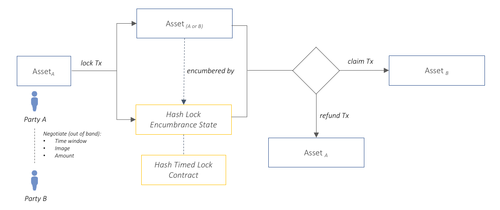

## Fair Exchange using Hashed Time Locked Contracts in Corda
Corda has a number of mechanisms built in to the protocol that make implementing HTLCs conceptually straight forward: 1) a general mechanism for conditionally locking assets 2) a mechanism for constraining the validity of certain actions to a time windows 3) a mechanism for trigger actions based on time events 4) Composite keys as a way of flexibly specifying which combination of parties owns and manages a state.

### Background Concepts

#### Encumbrance
  In Corda, additional constraints can be associated to states by attaching an Encumbrance State to them. Such an encumbrance, would have its own validation contract that overlays additional checks that can be used to restrict actions on the state. An encumbrance is attached and detached from a state through transactions.

#### Time Window
Corda supports the ability to constrain transactions to a defined time window. In the context of HTLCs this capability can be employed to specify the time range in which coin redemptions can occur, and the time point after which a refund claim is valid.

#### Time Triggered Actions
Corda supports the ability to schedule specific actions in a state at a specified time. In the context of HTLCs, this could be used to automatically process refunds once the HTLC expires, if claims haven't been submitted up to that point.

### HTLCs in CordApp
To create a Hashed Time Lock Contract in Corda, we need a generalised encumbrance state that encodes parameters of the HTLC agreement (i.e. time window, secret hash and identities of parties), and an associated contract which encodes the relevant validation logic (i.e. a state can be claimed by a counter party with a pre-image within a time window or redeemed by its original owner after). Each of these is briefly discussed below:

#### Hash Lock Encumbrance State
A generalised state class that encodes the properties of the HTLC such as the image of the secret, the time window within which a counter party can redeem the asset, and the public key of all involved parties as well as a reference to the binding contract logic. This state will be attached to an asset as an encumbrance, to conditionally lock the underlying asset.

#### Hash Lock Encumbrance Validation Contract
The validation contract ensures that all attempts to spend the underlying asset is validated against the conditions of the hashed lock encumbrance state. That is, it ensures that only the owner or the designated counter party can make claims against the event, that the counter-party can only claim the state upon presentation of the pre-image of the stored secret within the specified validity window, and that the owner can only claim a refund of the asset if the specified time period has elapsed.

#### Process
The procedures for setting up an HTLC one one Corda network, which would need to be mirrored in the counter party network, involves the following:
- Party A and B agree on terms of the contract (i.e. secret, time window, asset amount etc.)
- Party A creates a transaction that takes its asset state as input and produces i) a hash lock encumbrance state and ii) the asset state with a reference to the encumbrance. Party A sends this transaction to Party B.
- **Claiming**: Party B submits a transaction to claim the locked asset with the pre-image of the secret. If the pre-image is valid and the transaction is within the defined time window (as validated by the encumbrance contract), the output of the transaction will be a new state representing the asset with Party B as its owner that no longer has the encumbrance state attached to it.
- **Refund**: Party A submits a transaction to claim back its locked asset. If this claim occurs after the defined window has elapsed, then a new state representing the state with Part A as the owner is output that no longer has the encumbrance state attached to it.

Both claiming and refunding transactions can be performed unilaterally because during the locking phase the asset is associated with a Composite key of the two parties.

### Generalisability
The hash lock encumbrance state and associated contract can be offered as reusable pieces as part of Weaver. These pieces are largely agnostic of the specifics of the application. They can further be instrumented to *emit* custom Weaver events making automation of the orchestration of cross-chain HTLCs possible.
